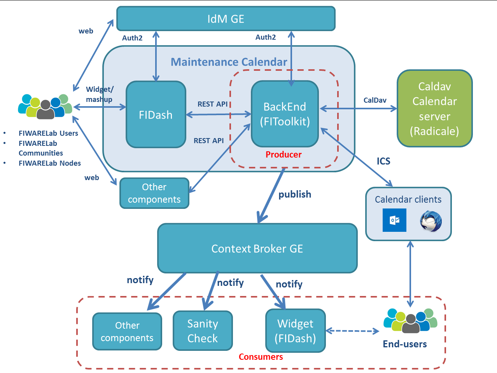
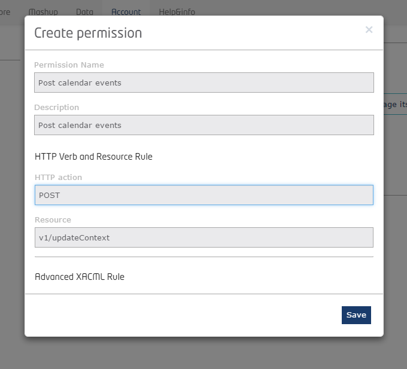
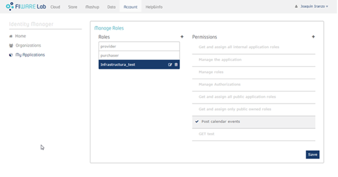
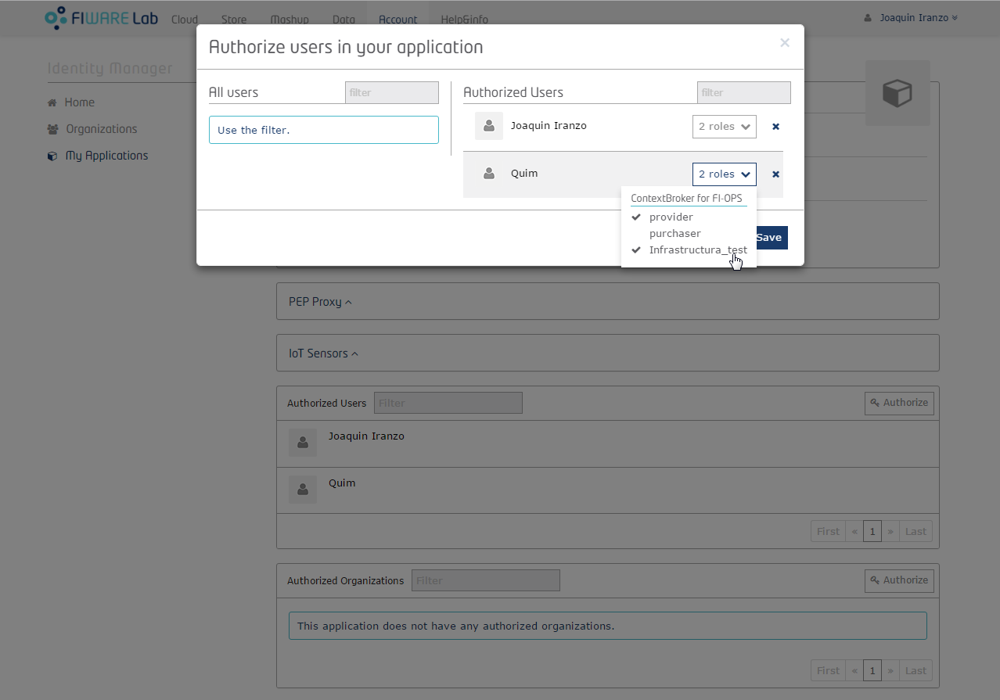

# Maintenance calendar API

The maintenance calendar API provides a simplification for the FIWARE-Ops (Fi-Dash components) in order to interact with standard Caldav servers. This project is part of [FIWARE](http://www.fiware.org/).

## Table of contents

* [Overall description](#overall-description)
* [Features implemented](#features-implemented)
* [Installation](#installation)
	* Maintenance Calendar installation
		* [Software Requirements](#software-requirements)
		* [Installation steps](#installation-steps)
		* [Configuration](#configuration)
		* [Installation verification](#installation-verification)
		* [Running](#running)
			* [Running in development mode](#running-in-development-mode)
			* [Deploying in production mode](#deploying-in-production-mode)
		* [Configure the users and roles](#configure-the-users-and-roles)
	* [Maintenance Notification system Installation](#maintenance-notification-system-installation)
		* [Installation steps](#installation-steps)
		* [Configure the Context Broker Instance](#configure-the-context-broker-instance)
		* [Configure the Authentication](#configure-the-authentication.)
		* [Configure the Authorization](#configure-the-authorization)
		* [Configuration Public access](#configuration-public-access)
		* [Installation verification of the Context Broker instance](#installation-verification-of-the-context-broker-instance)
		* [Configuration of Maintenance Calendar component](#configuration-of-maintenance-calendar-component)
* [Installation verification](#installation-verification)
	* [Maintenance Calendar without Notification system](#maintenance-calendar-without-notification-system)
	* [Maintenance Notification System](#maintenance-notification-system)
		* [Maintenance Calendar component verification](#maintenance-calendar-component-verification)
		* [Subscriptions verification](#subscriptions-verification)
* [API specification](#api-specification)
	* [Group Events](#group-events)
	* [Group Nodes](#group-nodes)
	* [Group iCalendar format](#group-icalendar-format)
* [License](#license)

## Overall description
The maintenance calendar component allows infrastructure operators to create maintenance events, so users and other FIWARE components can be aware. 

The component is based on the CalDAV internet standard (based in WebDAV), which allows multiple clients to access and share events information, as well as enables advanced online calendar functions, such as define user and group permissions or handle recurring events. So, any calendar server that implements the CalDAV standard could be integrated with the component, with minor changes on the CalDAV adaptor.

The component is integrated with the [Radicale calendar]( http://radicale.org/), which is a lightweight open-source (GPLv3) calendar server system. It implements basic operations such as store, update and serve calendar events using CalDAV. It does not provide any client nor any notification system. It is available in the main Linux distributions’ repositories. We have selected it due to its simplicity and the easy maintenance. Nevertheless, the component could be use another calendar servers system such as [DAViCal](http://www.davical.org/index.php), [Bedework](https://www.apereo.org/projects/bedework), [Google Calendar](https://calendar.google.com)...

We have considered two types of events:
* The maintenance events associated to a specific node. They will be managed by the own node and they will only create events for their node, if they have the infrastructure owner role. For example the Trento Organization has user with the privileges to manage the events of the Trento node (create and delete).

* The non-maintenance periods associated to all the nodes. These events indicate that during this period it should be forbidden doing maintenance at all the nodes. Only the people with the correct privileges can manage these kind of events, nevertheless with this role (which is the “uptime requester” role), they cannot create events for one node (only in the case that she/he has both roles “ infrastructure owner for one node” or the “uptime requester).

Remark that all the FIWARE users will be able to search and see all the events. The only condition is that they have to be identified by the IdM of FIWARE and the call to the API REst should include the correct token provided by the IdM.

In order to cover this two types of events, there are two different kinds of roles that can be assigned to the users (see the [IdM GE documentation](http://catalogue.fiware.org/enablers/identity-management-keyrock)):

* Infrastructure Owner Role. This role is managed by one organization (which is responsible to manage the node such as Trento, Spain2...), and it decides what users have this role in order to create the maintenance events. Moreover, these users only will be able to create events for this organization (associated node).

* Uptime Requester Role. This role is assigned directly to the user, so it should be included directly to his profile. When the user has this role, he will be able to create events for the non-maintenance periods. 

Note: It is out of reach the definition of the structure of the users/organizations and their roles. Hence, the component will validate the token (included in the header) and the profile of this user, after validating and getting this information from the IdM of FIWARE. For more information about the roles and their configuration see the [Fi-DASH components](https://github.com/fidash).

The maintenance calendar component has been developed in conjunction with the [Fi-Dash widget-calendar](https://github.com/fidash/widget-calendar). So, the component exposes a REST API in order to be integrated with the Fi-Dash components; allowing the infrastructure managers to create events for the maintenance periods and the uptime requesters to create events for the non-maintenance periods. Besides, the stakeholders of these events can obtain the complete calendar in format ics in order to be integrated with the other calendars tools such as the Outlook or the Thunderbird. 

Moreover, the component includes a notification system; allowing the consumers to receive notifications when an event is created, modified or deleted. The objective of the notification system is not to manage the events through this mechanism, and it focus on warning to the subscribed users of these notifications. This system is based on the existing GEs called [Orion Context Broker](http://catalogue.fiware.org/enablers/publishsubscribe-context-broker-orion-context-broker)

In the following figure the FIWARE Lab components that intervene in the Maintenance Calendar operations are depicted.

## Features implemented

The requirements list of this version (v1) is the following one:

* The FIWARE users can list all the available events, including both maintenance events and non-maintenance periods. They can filter by different parameters such as the start date, the end date and the two types of events (by node and by the non-maintenance periods).
* The infrastructures can create a new event associated to their node, and the users with the uptime requester role can create events of non-maintenance periods. 
* The FIWARE users can get the information of one specific event and see the details.
* The infrastructures can delete the events associated to their node, and the users with the uptime requester role can delete events of non-maintenance periods. 
* The component exposes the maintenance calendar with the iCalendar standard (ics format).
* The component includes a notification system for the maintenance events; allowing the consumers to receive notifications.

## Installation

The installation is composed by two steps:
* Maintenance Calendar: the component is installed without notifications. Nevertheless, all the functionalities will be working properly.
* Maintenance Notification System: The different components of the notification will be installed and configured such as the Context Broker GE and the Pep Proxy Wilma, afterwards the Maintenance Calendar component will be ready to be configured to use the Notification System. It is mandatory to have the first steps installed correctly in order to notify the maintenance events.

### Maintenance Calendar installation

#### Software requirements

Before to install the components:
* [Radicale calendar]( http://radicale.org/). Install a new instance (where you consider) or use existing one. It should be up and running before to install the component. 

The requirements to install a working copy of the maintenance calendar component are:
* Python 2.7
* Python 2.7 Virtualenv
* Python 2.7 Pip

#### Installation steps

The Maintenance Calendar component is a Python web application that uses the [Flask microframework](http://flask.pocoo.org/). The general recommendations when running Python applications is to use Virtualenv.

The Python virtual environments is a way to run isolated Python environments with different default Python version and libraries. This, for example, allows two run two different Python applications that rely on some common library but use different versions of it.

Pip is the package installer of Python. It allows to easily search, install and, in general, manage Python libraries. It also provides automatic dependency resolution and is able to generate and read requirements files. This file lists the libraries needed to be installed in order to execute the app.

The list of steps to get the Maintenance Calendar component installed is the following:

1. Install virtualenv

		$ pip install virtualenv

2. Create virtualenv

		$ virtualenv $VIRTUALENV_NAME

3. Activate virtualenv

		$ . $VIRTUALENV_NAME/bin/activate

4. Change to application directories and install requirements

		($VIRTUALENV_NAME)$ cd $MaintenanceCalendar_SYNC_DIR
		($VIRTUALENV_NAME)$ pip install -r requirements.txt

5. If you want logout the virtual environment connection

		$ deactivate

##### Download the project

Clone the project using git from the
[Maintenance calendar API](https://github.com/Atos-FiwareOps/fiware-maintenance-calendar-api)

	$ git clone https://github.com/Atos-FiwareOps/fiware-maintenance-calendar-api.git

#### Configuration

The Maintenance Calendar component needs minimal configuration, basically the parameters to connect to the Radicale calendar service and the IdM connection. The first step after cloning the code is to copy the config.py.sample file to config.py.sample (you can find this file in the $PROJECT_DIR/maintenance_calendar/ directory). The parameter that can be adjusted are:

Basic Parameters
* url_keystone: The url of the FIWARE IdM. It should contain the compleate URL including the parameter of the token, for example https://account.lab.fiware.org/user/?access_token=".
* url_calendar = The url of the Radicale Calendar, for example "http://xxx.xxx.xxx.xxx:5232/fiware/".
* ics_calendar = The internal ics of the Radical Calendar, for example "NodesMaintenance.ics".
* active_context_broker = it indicates if the system will send notifications to the Context Broker. If, the value is "True", we need to configure more parameters, see section "Context Broker Configuration".

Log configuration
* log_file: the relative path, where the log file will be generated, for example "log/simpler_logger.log", the folder should be created previously.
* maxbytes_log_file: The maxim size of the log file, for example '2000000' bytes
* backupCount_log_file: number of backups availables for the log file.
* formatter_log: the format of the messages in the log file and console.
* log_level: it indicates the level of the logging messages. The possible values are ERROR, WARNING, INFO and DEBUG

#### Running

Flask offers a lightweight embedded server for development purposes. It allows to run quickly the application without having to worry about production server configurations. It also allows, in combination with other Python tools, to debug the running app, as well as automatic reloading when the code changes (so stop and start it is not needed when a change is performed in the code). Anyway, this is not recommended for production environments.

In that case, several web server projects allow the deployment and run of Python code. For example, when using other application servers, Apache and Nginx can be used. Since the combination possibilities are large, we will explain here one
we have tested. It is based on Nginx, Gunicorn and Supervisor, running on a Debian stable Linux distribution. Please, feel free to send us feedback about other possible configurations.

##### Running in development mode

Running the Maintenance Calendar component using Flask development server is easy. Please, take into account that to run it, it is necessary to have the proper configuration as stated before. If this have been done, follow the following steps:

1. Activate virtualenv

		$ . $VIRTUALENVS_NAME/bin/activate

2. Change to the application directory

		($VIRTUALENV_NAME)$ cd $PROJECT_DIR

3. Start server

		($VIRTUALENV_NAME)$ python runserver.py

	The default URL served by the server is http://127.0.0.1:5000/. Nevertheless, the python file (runserver.py) has been configured to use the 8085 port ("app.run(host='0.0.0.0', port=8085, debug=True)"). You can find more information about the development server in the [Flask documentation webpage](http://flask.pocoo.org/docs/0.10/).

4. Test

		* without token
		$ curl http://localhost:8085/api/v1

		Could not verify your access level for that URL. You have to login with proper token

		* With the correct token
		$ curl http://localhost:8085/api/v1 -H 'X-Auth-Token:<Token_ID>' 

		Hello World! 

##### Deploying in production mode

As mentioned before, several deployment configurations are possible. In this section we described how we deployed this in a production environment using Ubuntu 14, Nginx, Gunicorn, Supervisor and Virtualenv.

It is recommended not to use the root account. You have to create a new account with root privileges. 
Once you are logged in as root account, we are going to add the new user account which will use to log in in order to install and deploy the component.
	$ adduser <user_name>

The system will ask you few questions, starting with the account password (introduce a strong password).

Add the new user to the sudo group in order to have administrative tasks. Afterwards, the whole deployment will be executed with this new user account.
	$ gpasswd -a <user_name> sudo

We suppose that you have performed the installation steps and you have set up a virtual environment for the project.

We also suppose those global variables:
* $PROJECT_DIR: the directory the Maintenance Calendar component code has been placed.
* $VIRTUALENV_DIR: the directory where the dedicated virtual environment for the Maintenance Calendar component resides.

Most of the scripts have are based on [Michał Karzyński](https://gist.github.com/postrational)
Gist examples on [how to set up Django on Nginx with Gunicorn and supervisor](https://gist.github.com/postrational/5747293#file-gunicorn_start-bash) and on the
[Flask documentation](http://flask.pocoo.org/docs/0.10/deploying/wsgi-standalone/#gunicorn)

The steps are the following:

1. Install the dependences in the virtual environment.
		<venv>$ sudo pip install gunicorn

2. Prepare the component to be executed by gunicorn. 

	* Uncomment the following row in the file maintenance_calendar/__init__.py

		from flask import Flask
		app = Flask(__name__)
		#This import allows the gunicorn to see the views
		#uncomment next row, if you want to use gunicorn application such as production environments.
		import maintenance_calendar.views

	* Update the runserver.py file to change the debug attribute to False ("app.run(host='0.0.0.0', port=8085, debug=False)"). Morover, you need to modify the attribute "log_level" in the confi.py file to ERROR or WARNING. They only need to be changed if we need to investigate or analyze strange behaviour in the production server.

3. Start Maintenance Calendar and validate that the gunicorn is working correctly

		<venv>$ gunicorn -w 4 maintenance_calendar:app
		[2016-04-26 14:07:59 +0000] [1593] [INFO] Starting gunicorn 19.4.5
		[2016-04-26 14:07:59 +0000] [1593] [INFO] Listening at: http://127.0.0.1:8000 (1593)
		[2016-04-26 14:07:59 +0000] [1593] [INFO] Using worker: sync
		[2016-04-26 14:07:59 +0000] [1598] [INFO] Booting worker with pid: 1598
		[2016-04-26 14:07:59 +0000] [1599] [INFO] Booting worker with pid: 1599
		[2016-04-26 14:07:59 +0000] [1600] [INFO] Booting worker with pid: 1600
		[2016-04-26 14:07:59 +0000] [1601] [INFO] Booting worker with pid: 1601

		You can see that we have created four worker processes to attend the request by Gunicorn. This number should generally be between 2-4 workers per core in the server.

		Test the installation: in another terminal, executing the "Hellow Word" request.
		$ curl -X GET "http://localhost:8000/api/v1" -H 'X-Auth-Token:<Token_ID>'

		It is important to validate the installation for every step in order to facilitate the identification of the errors.

4. Create a Gunicorn start script

	This script can be placed wherever you want. In our case, we placed it in
	$PROJECT_DIR/bin/gunicorn_start.

		#!/bin/bash

		NAME="maintenance_calendar"          # Name of the application
		PROJECTDIR=$PROJECT_DIR              # Project directory
		USER=root                            # the user to run as
		GROUP=root                           # the group to run as
		NUM_WORKERS=4                        # how many worker processes should Gunicorn spawn

		# Activate the virtual environment
		cd $PROJECT_DIR
		source $VIRTUALENV_DIR/bin/activate
		export PYTHONPATH=$PROJECT_DIR:$PYTHONPATH

		# Start your Flask Unicorn
		# Programs meant to be run under supervisor should
		#   not daemonize themselves (do not use --daemon)
		exec $VIRTUALENV_DIR/bin/gunicorn ${NAME}:app \
		  --name $NAME \
		  --workers $NUM_WORKERS \
		  --user=$USER --group=$GROUP \
		  --log-level=error \
		  --log-file=-

	Execute the file and validate it.

		$ ./gunicorn_start
	
	Test the installation: in another terminal, executing the "Hellow Word" request.

		$ curl -X GET "http://localhost:8000/api/v1" -H 'X-Auth-Token:<Token_ID>'

5. Install the dependences

		$ sudo aptitude install nginx supervisor

6. Create the Supervisor script to start/stop the application:

	It should be placed in /etc/supervisor/conf.d/MaintenanceCalendar.conf and should
	contain the following parameters:

		[program:MaintenanceCalendar]
		command = $PROJECT_DIR/bin/gunicorn_start                   ; Command to start app
		user = root                                                 ; User to run as
		stdout_logfile = $PROJECT_DIR/logs/gunicorn_supervisor.log  ; Where to write log messages
		redirect_stderr = true                                      ; Save stderr in the same log
		environment=LANG=en_US.UTF-8,LC_ALL=en_US.UTF-8 

7. Create Nginx virtual servers

	This script should be placed in /etc/nginx/sites-available/MaintenanceCalendar

		upstream MaintenanceCalendar_app_server {
		  # fail_timeout=0 means we always retry an upstream even if it failed
		  # to return a good HTTP response (in case the Unicorn master nukes a
		  # single worker for timing out).

		  server unix:$PROJECT_DIR/gunicorn.sock fail_timeout=0;
		}

		server {
			listen   0.0.0.0:80;
			server_name localhost {public_ip};

			client_max_body_size 4G;

			access_log $PROJECT_DIR/logs/nginx-access.log;
			error_log $PROJECT_DIR/logs/nginx-error.log;

			location /maintenance_calendar/ {
				# an HTTP header important enough to have its own Wikipedia entry:
				#   http://en.wikipedia.org/wiki/X-Forwarded-For
				proxy_set_header X-Forwarded-For $proxy_add_x_forwarded_for;

				# enable this if and only if you use HTTPS, this helps Rack
				# set the proper protocol for doing redirects:
				# proxy_set_header X-Forwarded-Proto https;

				# pass the Host: header from the client right along so redirects
				# can be set properly within the Rack application
				proxy_set_header Host $http_host;

				# we don't want nginx trying to do something clever with
				# redirects, we set the Host: header above already.
				proxy_redirect off;

				# set "proxy_buffering off" *only* for Rainbows! when doing
				# Comet/long-poll stuff.  It's also safe to set if you're
				# using only serving fast clients with Unicorn + nginx.
				# Otherwise you _want_ nginx to buffer responses to slow
				# clients, really.
				# proxy_buffering off;

				proxy_pass http://localhost:8000/;

				}
			}
		}

8. Start/restart the application using supervisor:

		$ sudo supervisorctl restart MaintenanceCalendar

9. Add the virtual server for the Maintenance Calendar component to the directory of enabled sites and restart Nginx:

		$ sudo ln -s /etc/nginx/sites-available/MaintenanceCalendar /etc/nginx/sites-enabled
		$ sudo service nginx restart

10. Installation verification
	Execute the "Hellow Word" request.
		$ curl -X GET "http://<public_ip>:8000/api/v1" -H 'X-Auth-Token:<Token_ID>'

#### Configure the users and roles

As it has been commented, the IdM is responsible of i) managing the correct roles for the different users and organizations (associating them correctly) ii) validating the token iii) providing the detailed profile of the user for this token. Hence, there will be two main behaviour depends on the IdM answer:
* The authenticated users without the correct roles can search and see the details of the events, but they cannot create and delete events.
* The authenticated users with the appropriated roles can manage their events.

### Maintenance Notification system Installation

The [Orion Context Broker GE](http://catalogue.fiware.org/enablers/publishsubscribe-context-broker-orion-context-broker) has been selected as a component to notify the events of the maintenance calendar. The configuration of the Maintenance Calendar component is integrated by default with the public instance of the FIWARE ecosystem, nevertheless, this common instance only authenticates users of the ecosystem and does not introduce any kind of authorization to manage the resources. Hence, in order to introduce our authorization to publish the notifications (only the users with the correct permissions have to be able to publish these notifications), a proprietary instance of the Context Broker GE has to be installed. Coming up next, it is explained how to create and configure the Context Broker and the [PeP proxy Wilwa](http://catalogue.fiware.org/enablers/pep-proxy-wilma) for our own instance. It is not the intention to deep into the installation of the GEs, since they are well described in their documentation.

#### Installation steps

* Install the Orion Context Broker GE. There are four ways to install the component as it is indicated [here](http://catalogue.fiware.org/enablers/publishsubscribe-context-broker-orion-context-broker/creating-instances). You can find more details about the installation and the user manual [here](https://fiware-orion.readthedocs.io/en/develop/)

* Install the PeP proxy Wilma GE. As we need to install the Pep Proxy in the same instance that we have installed the Orion Context Broker (see the above step). We are going to install the PeP proxy manually; following the installation [guide](http://fiware-pep-proxy.readthedocs.io/en/latest/admin_guide/). Nevertheless, there are other ways to install the component as it is indicated [here](http://catalogue.fiware.org/enablers/pep-proxy-wilma/creating-instances). 

* Create a new application in the FIWARELab IdM portal for our Context Broker GE and associate a PeP proxy, you can see the details [here](http://fiware-idm.readthedocs.io/en/v4.4.0/user_guide/). 

As we have commented, it is not the intention to detail here all the steps, since it is well described in the documentation, nevertheless, the different attributes of the PeP Proxy configuration are detailed in order to understand the correlation between them. 
Hence, we are going to configure the PeP Proxy Wilma GE to authenticate and authorize the users of the FIWARE ecosystem, since without the PeP Proxy our Orion instance is completely accessible for all the users.

#### Configure the Context Broker Instance.

It is necessary to execute the script bin/ConfigurationMaintenanceCalendarForNotifications.sh to initialise entities for the Maintenance Calendar notification in the Context Broker instance (variable: host_contex_broker, see above bullet list. The following variables should be modified in order to be aligned with the instance of the Context Broker:

* IP_CONTEXT_BROKER = The endpoint of the Orion Context broker instance, for example the generic instance of FIWARE Lab as SaaS "http://orion.lab.fiware.org:1026". It should be aligned with the own instance of the Context Broker (aligned with config.py file).
* TOKEN_CONTEXT_BROKER =  Token for accessing to the Context Broker. You need an account in FIWARE Lab to obtain this token, see the [documentation of the Context Broker](https://fiware-orion.readthedocs.io/en/develop/quick_start_guide/index.html)

#### Configure the Authentication.
Modify the config.js file with these attributes values:

		var config = {};

		config.pep_port = 1026;

		// Set this var to undefined if you don't want the server to listen on HTTPS
		config.https = {
		    enabled: false,
		    cert_file: 'cert/cert.crt',
		    key_file: 'cert/key.key',
		    port: 443
		};

		config.account_host = 'https://account.lab.fiware.org';

		config.keystone_host = 'cloud.lab.fiware.org';
		config.keystone_port = 4731;

		config.app_host = '192.168.1.251';
		config.app_port = '10026';
		// Use true if the app server listens in https
		config.app_ssl = false;

		// Credentials obtained when registering PEP Proxy in Account Portal
		config.username = 'pep_proxy_8fe51be1cbbb4f8c9893a842800a05e2';
		config.password = 'xxxxxxxxxxxxxxxxxxxxxxxxx';

		// options: oauth2/keystone
		config.tokens_engine = 'oauth2';

The explanation of the different attributes:

* config.pep_port
We want to maintain the 1026 as a main port for notifying calendars events, although you can decide what are the best ports to expose the notifications service. 
In our case, we need to:

** update the configuration file of the Context Broker (/etc/sysconfig/contextBroker) and modify the variable BROKER_PORT to the appropriated port, more details [here](https://fiware-orion.readthedocs.io/en/develop/admin/running/index.html)

** update the port parameter of the PeP Proxy configuration file (fiware-pep-proxy/config.js): config.pep_port = 1026;

* config.account_host
if you want to use the option “oauth2” for the tokens_engine parameter, you will need to introduce the instance of the KeyRock GE, in our case, we are using the FIWARE Lab instance 'https://account.lab.fiware.org'

* config.keystone_host
if you want to use the option “keystone” for the tokens_engine parameter, you will need to introduce the instance of the OpenStack KeyStone (cloud.lab.fiware.org' port 4731).

* config.username and config. password
We need to introduce the same user and password (PEP Proxy) created for the application, see next figure.

After configuring the Orion Context Broker GE and the PeP Proxy GE, we need to test the installation for the authentication:

		$ curl <instace_Orion_contextBroker>:1026/v1/contextEntities/maintenancecalendar:UptimeRequest -X GET
		Auth-token not found in request header

We need to introduce the correct token in the header, test with an incorrect token:

		$ curl 212.128.217.106:1026/v1/contextEntities/maintenancecalendar:UptimeRequest -X GET --header "X-Auth-Token:dummyTokencurl"
		User token not authorized

Now, we can generate the token associated to our application (or a valid token for the FIWARELab ecosystem) as follow:

		curl --user <ClientID>:<ClientSecret> -X POST -H "Content-Type: application/x-www-form-urlencoded" https://account.lab.fiware.org/oauth2/token -d 'grant_type=password&username=<User_Name_FIWARE>&password=<password_User_FIWARE>'

		{
		    "access_token": "sl3Z12oozWR6wDMAySAai9J1wL7A76",
		    "expires_in": 3600,
		    "refresh_token": "z5GrthR6hTmL7NE76mMqt9fIfbeRkc",
		    "token_type": "Bearer"
		}

NOTE: where the ClientID and ClientSecret are provided in the FIWARE Lab IdM, see the above image (Auth2 Credentials).

Now, we need to include this token in the header request

		$ curl 212.128.217.106:1026/v1/contextEntities/maintenancecalendar:UptimeRequest -X GET --header "X-Auth-Token:sl3Z12oozWR6wDMAySAai9J1wL7A76"
		{
		  "contextElement" : {
		    "type" : "UptimeRequest",
		    "isPattern" : "false",
		    "id" : "maintenancecalendar:UptimeRequest",
		    "attributes" : [
		      {
		        "name" : "event",
		        "type" : "string",
		        "value" : "UptimeRequest"
		      },
		      {
		        "name" : "type_event",
		        "type" : "string",
		        "value" : "New"
		      },
		      {
		        "name" : "uptimerequest_description",
		        "type" : "string",
		        "value" : "Initial notification"
		      }
		    ]
		  },
		  "statusCode" : {
		    "code" : "200",
		    "reasonPhrase" : "OK"
		  }
		}

#### Configure the Authorization

Configure the PeP proxy Wilma to authorize only some users to execute some  actions. 

		// if enabled PEP checks permissions with AuthZForce GE.
		// only compatible with oauth2 tokens engine
		//
		// you can use custom policy checks by including programatic scripts
		// in policies folder. An script template is included there
		config.azf = {
		        enabled: true,
		    host: 'auth.lab.fiware.org',
		    port: 6019,
		    custom_policy: undefined // use undefined to default policy checks (HTTP verb + path).
		};

The explanation of the different attributes:

* config.azf: change the enabled attribute to true.

* Configure the permissions; introducing the actions that you want to protect, for example the creation of calendar events, in our case, we are using a POST action for the resource v1/updateContext.

* Create the new role to assign this permission.

* Assign this role to the FIWARE users who have to notify the calendar events, in our case the Maintenance Calendar account (quim user). Therefore, only the tokens associated to this FIWARE account, which contains this role, will be able to create new events for the Maintenance Calendar.

* After activating the authorization, we need to define the permissions and roles for all the resources and actions. For example, now the GET of the v1/contextEntities/maintenancecalendar:UptimeRequest is not allowed, since it is not created a permission and role to manage it.

		curl 212.128.217.106:1026/v1/contextEntities/maintenancecalendar:UptimeRequest -X GET --header "X-Auth-Token:sl3Z12oozWR6wDMAySAai9J1wL7A76"
		User token not authorized

You can decide to create more rules to manage all the actions or to open the rest of the action for all the user, see next section:

#### Configuration Public access

Nevertheless, we can also allow all the users to access to a public part of the component, modifying the configuration file and add the public URLs. For example to access to the UptimeRequest and NodeMaintenace.

		// list of paths that will not check authentication/authorization
		// example: ['/public/*', '/static/css/']
		config.public_paths = ['/v1/contextEntities/maintenancecalendar:*', '/v1/subscribeContext'];

Now, we can execute again the request without the token, the response will be allowed.

		$ curl 212.128.217.106:1026/v1/contextEntities/maintenancecalendar:UptimeRequest -X GET
		{
		  "contextElement" : {
		    "type" : "UptimeRequest",
		    "isPattern" : "false",
		    "id" : "maintenancecalendar:UptimeRequest",
		    "attributes" : [
		      {
		        "name" : "event",
		        "type" : "string",
		        "value" : "UptimeRequest"
		      },
		      {
		        "name" : "type_event",
		        "type" : "string",
		        "value" : "New"
		      },
		      {
		        "name" : "uptimerequest_description",
		        "type" : "string",n
		        "value" : "Initial notification"
		      }
		    ]
		  },
		  "statusCode" : {
		    "code" : "200",
		    "reasonPhrase" : "OK"
		  }
		}

The subscription is also allowed since it is configured as a public, for the subscription examples see section "Notifications".

#### Installation verification of the Context Broker instance

To check that everything was correctly installed, perform the following HTTP call, for example for the Lannion node:

		$  curl -X GET "http://orion.lab.fiware.org:1026/v1/contextEntities/maintenancecalendar:Lannion2" -H 'X-Auth-Token:<Token_ID>'

It should return the initial notification.

	{
	  "contextElement" : {
	    "type" : "Node",
	    "isPattern" : "false",
	    "id" : "maintenancecalendar:Lannion2",
	    "attributes" : [
	      {
	        "name" : "event",
	        "type" : "string",
	        "value" : "Maintenance"
	      },
	      {
	        "name" : "location",
	        "type" : "string",
	        "value" : "France"
	      },
	      {
	        "name" : "maintenance_description",
	        "type" : "string",
	        "value" : "Initial notification"
	      },
	      {
	        "name" : "type_event",
	        "type" : "string",
	        "value" : "New"
	      }
	    ]
	  },
	  "statusCode" : {
	    "code" : "200",
	    "reasonPhrase" : "OK"
	  }
	}

#### Configuration of Maintenance Calendar component

It is necessary to configure the Maintenance Calender to publish the events in our Orion Context Broker. The parameter to configure the notification are:

* active_context_broker = This parameter indicates if the system will send notifications to the Context Broker. Hence, it should have the value "True" for the notifications.

* host_contex_broker = The endpoint of the Orion Context broker instance, for example the Orion instance that you have installed (the generic instance of FIWARE Lab as SaaS "http://orion.lab.fiware.org:1026" is also possible to use without the authorization) 
* url_idm = URL to obtain the correct token for calling the Context Broker application, in our case is the general instance: https://account.lab.fiware.org/oauth2/token
* client_id_context_broker = client identifier for the Context Broker application provided by the IdM (see the section "Configure the Authentication")
* client_secret_context_broker = client secret for the Context Broker application provided the IdM (see the section "Configure the Authentication")
* user_context_broker = FIWARE account with the appropriate role and permission for the Context Broker application, which has been configured at the IdM platform (See the section "Configure the Authorization").
* pwd_user_context_broker = user password of the previous account.
* timeout_context_broker = It indicates the time-out of the Context Broker communication in seconds.

## Installation verification

### Maintenance Calendar without Notification system

To check that everything was correctly installed, run the project in development mode and perform the following HTTP call:

		$  curl -X GET "http://localhost/api/v1/events" -H 'X-Auth-Token:<Token_ID>'

It should return an empty JSON list.

### Maintenance Notification System

#### Maintenance Calendar component verification

To check that everything was correctly installed; create a new event for the UptimeRequest and perform the following HTTP call to see the new status (where the "<HoST_Context_Broker>" is the endpoint of the own Orion Context Broker instance):

		$  curl -X GET "http://<HoST_Context_Broker>:1026/v1/contextEntities/maintenancecalendar:UptimeRequest" 

It should return the UptimeRequest event that you have created.

	{
	  "contextElement" : {
	    "type" : "UptimeRequest",
	    "isPattern" : "false",
	    "id" : "maintenancecalendar:UptimeRequest",
	    "attributes" : [
	      {
	        "name" : "event",
	        "type" : "string",
	        "value" : "UptimeRequest"
	      },
	      {
	        "name" : "type_event",
	        "type" : "string",
	        "value" : "NEW"
	      },
	      {
	        "name" : "uptimerequest_description",
	        "type" : "string",
	        "value" : "Summary Test UptimeRequests"
	      }
	    ]
	  },
	  "statusCode" : {
	    "code" : "200",
	    "reasonPhrase" : "OK"
	  }
	}

#### Subscriptions verification

The consumers only need to subscribe in the events that they want to receive the notifications. This section only covers some examples of subscriptions for: i) specific node events ii) all the nodes events iii) UptimeRequest events and iv) all the events of the calendar.
For all this examples, the following prerequisites are necessary:

* The subscribers need to have a service to receive the notification, for example in the following examples is http://<host:port>/api/v1/testOrion, therefore, it should be changed by the correct one.

* The endpoint of the Orion Context broker should be aligned with the instance that has been installed (see previous sections). So, These examples are using the common instance of the Orion Context Broker "orion.lab.fiware.org:1026/v1/subscribeContext", but it should be changed by the correct one (see the installation section).

* If the subscriptions are not public (you can decide it at section "Configuration Public access"), you will need an account in FIWARE Lab. With that account you can obtain a valid authentication token ("<Valid-Token>") to use in the REST API calls to Orion. To get that token, get and run the "token_script.sh" script. Introduce your FIWARE Lab user and password when the scripts ask for it (more details [here](https://fiware-orion.readthedocs.io/en/develop/quick_start_guide/index.html)):

		$ wget --no-check-certificate https://raw.githubusercontent.com/fgalan/oauth2-example-orion-client/master/token_script.sh
		$ bash token_script.sh
		Username: your_email@example.com
		Password:
		Token: <this is the token you need>

Examples of subscriptions:

* **Subscription for specific node events**: The consumer only will receive the notifications generated by the Spain2 node.

		$ curl orion.lab.fiware.org:1026/v1/subscribeContext -s -S --header 'Content-Type: application/json' --header 'Accept: application/json' --header "X-Auth-Token:<Valid-Token>" -d @- <<EOF
			{
			    "entities": [
			        {
			            "type": "Node",
			            "isPattern": "false",
			            "id": "maintenancecalendar:Spain2"
			        }
			    ],
			    "attributes": [],
			    "reference": "http://<host:port>/api/v1/testOrion",
			    "duration": "P1M",
			    "notifyConditions": [
			        {
			            "type": "ONCHANGE",
			            "condValues": []
			        }
			    ]
			}
			EOF

* **Subscription for all node events**: The consumer only will receive the notifications generated by all the nodes.
	
		$ curl orion.lab.fiware.org:1026/v1/subscribeContext -s -S --header 'Content-Type: application/json' --header 'Accept: application/json' --header "X-Auth-Token:<Valid-Token>" -d @- <<EOF
		{
		    "entities": [
		        {
		            "type": " Node ",
		            "isPattern": "true",
		            "id": "maintenancecalendar:.*"
		        }
		    ],
		    "attributes": [],
		    "reference": "http://<host:port>/api/v1/testOrion",
		    "duration": "P1M",
		    "notifyConditions": [
		        {
		            "type": "ONCHANGE",
		            "condValues": []
		        }
		    ]
		}
		EOF

* **Subscription for the UptimeRequest events**: The consumer only will receive the notifications generated by all the non-maintenance periods (UptimeRequest type).

		$ curl orion.lab.fiware.org:1026/v1/subscribeContext -s -S --header 'Content-Type: application/json' --header 'Accept: application/json' --header "X-Auth-Token:<Valid-Token>" -d @- <<EOF
		{
		    "entities": [
		        {
		            "type": "UptimeRequest",
		            "isPattern": "false",
		            "id": "maintenancecalendar:UptimeRequest"
		        }
		    ],
		    "attributes": [],
		    "reference": "http://<host:port>/api/v1/testOrion",
		    "duration": "P1M",
		    "notifyConditions": [
		        {
		            "type": "ONCHANGE",
		            "condValues": []
		        }
		    ]
		}
		EOF

* **Subcription for any change in the calendar**: The consumer will receive all notifications generated by any event of the calendar.

		$ curl orion.lab.fiware.org:1026/v1/subscribeContext -s -S --header 'Content-Type: application/json' --header 'Accept: application/json' --header "X-Auth-Token:<Valid-Token>" -d @- <<EOF
		{
		    "entities": [
		        {
		            "type": " Node ",
		            "isPattern": "true",
		            "id": "maintenancecalendar:.*"
		        }
		    ],
		    "attributes": [],
		    "reference": "http://<host:port>/api/v1/testOrion",
		    "duration": "P1M",
		    "notifyConditions": [
		        {
		            "type": "ONCHANGE",
		            "condValues": []
		        }
		    ]
		}
		EOF

The message body that the consumer will receive has the following structure:

		{
			"subscriptionId":"5742ff59fca84a197cef3db8",
			"originator":"localhost",
			"contextResponses":[
				{
				"contextElement":{	
					"type":"UptimeRequest",
					"isPattern":"false",
					"id":"maintenancecalendar:UptimeRequest",
					"attributes":[
							{
							"name":"event",
							"type":"string",
							"value":"UptimeRequest"
							},
							{
							"name":"type_event",
							"type":"string",
							"value":"NEW"
							},
							{
							"name":"uptimerequest_description",
							"type":"string",
							"value":"Non-Maintenace period for Nodes"
							}
						]
					},
				"statusCode":{
					"code":"200",
					"reasonPhrase":"OK"
					}
				}
			]
		}

The notifications system is completely flexible, so the subscribers can be warned only for the specific attributes of the nodes and UptimeRequest events, you only need to follow the documentation of the [Orion Context Broker](https://fiware-orion.readthedocs.io/en/develop/index.html).

## API specification

Note: there is an [Apiary version](http://docs.fiwaremaintenancecalendar.apiary.io) of this page with a more readable and structured format, as well as a mock server to perform some tests at.

### Group Events
Resources related to Events in the API.

#### Events Collection [/v1/events?location={location}&start={start}&end={end}]
##### List Events [GET]

This functionality allows the FIWARE user to get all the events, including both maintenance events per node and the non-maintenance periods. All the parameters are optional, hence, if the user doesn’t introduce any parameter, they will see all the events. When some parameters are introduced, the result will contain only the events that compliant them. 
The parameters are optionals:
+ location: the result only contains the events of this location. This indicate the location of the events, so, if the user introduces one node name, he only will see the events for this node. For the non-maintenance periods, the user has to introduce the UptimeRequests value. 
+ Start: the result only contains the events that start on this date with the mask yyyy-mm-dd HH:MM:SS+Z.
+ End: the result only contains the events that end on this date with with the mask yyyy-mm-dd HH:MM:SS+Z

For example, with the node attribute:
+ Location: Trento. It returns all the events for the Trento node
+ Location: UptimeRequests. It returns all the events for the non-maintenance periods.
+ Location: Trento + start: 2016-01-01. It returns all the events for the Trento node from 2016-01-01. (The same for the casuistic *Node:UptimeRequests)
+ Location: Trento + start: 2016-01-01 + end: 2018-01-01. It returns all the events for the Trento node between the period [2016-01-01 // 2018-01-01](The same for the casuistic Node:UptimeRequests)
Without the node attribute:
+ Start: 2016-01-01. It returns all the events (both types) from the 2016-01-01.
+ Start: 2016-01-01 + end: 2018-01-01. It returns all the events (both types) between the period [2016-01-01 // 2018-01-01]
+ Parameters
    + location (optional, number) - the result only contains the events of this location. This indicate the location of the events, so, if the user introduces one node name, he only will see the events for this node. For the non-maintenance periods, the user has to introduce the UptimeRequests value.
    + start (optional, string) - the result only contains the events that start on this date with the mask yyyy-mm-dd HH:MM:SS+Z.
    + end (optional, string) - the result only contains the events that end on this date with with the mask yyyy-mm-dd HH:MM:SS+Z
+ Request
    + headers
    
            X-Auth-Token: <token provided by FIWARE IdM>

+ Response 200 (application/json)

        {
            "events": [
                {
                    "description": "Test description Trento Maintenance",
                    "dtend": "2016-12-28 20:45:00+0000",
                    "dtstamp": "2015-12-22 00:24:03+0000",
                    "dtstart": "2016-12-28 12:00:00+0000",
                    "location": "Trento",
                    "summary": "Maintenace2 Node Trento",
                    "uid": "4e001d86-a842-11e5-b21e-fa163e9117cc"
                },
                {
                    "description": "Test description Trento Maintenance",
                    "dtend": "2016-12-25 18:45:00+0100",
                    "dtstamp": "2015-12-21 09:21:43+0000",
                    "dtstart": "2016-12-22 11:00:00+0100",
                    "location": "Trento",
                    "summary": "Maintenace Node Trento",
                    "uid": "9d55944c-d34c-4228-bee8-60ceec6f1e57"
                }
            ]
        }

+ Response 401 (text/plain)

        UNAUTHORIZED, returned when incorrect token has been provided.
        
        + body
            
            Could not verify your access level for that URL. You have to login with proper token}
        
##### Create a New Event [POST]
This action creates a new Event at the Calendar. As it has been described, there are two types of events:
+ Node maintenance is indicated through the name of the node at the location attribute. The node name should be aligned with the name of the organization where the user has the role of the infrastructure owner.
+ Non-maintenance periods are indicated through the UptimeRequests value at the location attribute. The user has to have the “uptime requester” role.
In order to create a new event, it takes a JSON object containing an event:
+ location (required, string) - The location where the event will be created. On one side, the node name indicate the maintenance period for this infrastructure. On other side, the UptimeRequests value indicates the non-maintenance periods.
+ summary (required, string) - The summary will be the title of the event in order to synthesize the content.
+ description (required, string) - The description explains the details of the events.
+ dtend (required, string) - The data of the end event with the mask yyyy-mm-dd HH:MM:SS+Z
+ dtstart (required, string) - The data of the start event with the mask yyyy-mm-dd HH:MM:SS+Z
+ Request (application/json)
    + headers
    
            X-Auth-Token: <token provided by FIWARE IdM>
    + body
            
            {
                "location": "Trento",
                "summary": "Maintenace2 Node Trento",
                "description": "Test description Trento Maintenance",
                "dtend": "2016-12-29 20:45:00+0100",
                "dtstart": "2016-12-29 12:00:00+0100"
            }
            
+ Response 201 (application/json)
    + Body

            {
                "event":{
                    "description":"Test description Trento Maintenance",
                    "dtend":"2016-12-29 20:45:00+0100",
                    "dtstamp":"2015-12-22 00:24:03+0000",
                    "dtstart":"2016-12-29 12:00:00+0100",
                    "location":"Trento",
                    "summary":"Maintenace2 Node Trento",
                    "uid":"4e001d86-a842-11e5-b21e-fa163e9117cc"
                }
            }

+ Response 401 (text/plain)
    
    UNAUTHORIZED, returned when incorrect token has been provided. 

    + Body
            
            Could not verify your access level for that URL. You have to login with proper token

+ Response 405 (text/plain)
    
    Method not allowed, returned when the user doesn't have rigth access to this resources.
    
    + Body
    
            The method specified in the Request-Line is not allowed for the resource identified by the Request-URI.

#### Event [/v1/events/{event_uid}]
##### Get Event info [GET]

The users can get the information of event_uid and see the details.
+ Parameters
    + event_uid (string) - Id of the event
+ Request
    + Headers
            X-Auth-Token: <token provided by FIWARE IdM>
+ Response 200 (application/json)

        {
            "event": {
                "description": "Test description Spain Maintenance",
                "dtend": "2016-01-29 20:45:00+0000",
                "dtstamp": "2015-12-22 22:31:10+0000",
                "dtstart": "2016-01-29 12:00:00+0000",
                "location": "Spain2",
                "summary": "Maintenace2 Node Spain",
                "uid": "51d615c6-a8f3-11e5-9141-00ff90f60b0b"
            }
        }
+ Response 401

    UNAUTHORIZED, returned when incorrect token has been provided. 

    + Body
        
            Could not verify your access level for that URL. You have to login with proper token
            
##### Delete Event [DELETE]
The infrastructures can delete the events associated to their node, and the users with the uptime requester role can delete events of non-maintenance periods.
+ Parameters
    + event_uid (string) - Id of the event
+ Request
    + Headers
            X-Auth-Token: <token provided by FIWARE IdM>
+ Response 204
+ Response 404
    
    + Body
            
            Not Found Event
+ Response 401

    UNAUTHORIZED, returned when incorrect token has been provided. 

    + Body
            Could not verify your access level for that URL. You have to login with proper token
            
+ Response 405
    
    Method not allowed, returned when the user doesn't have rigth access to this resources.
    
    + Body
        
            The method specified in the Request-Line is not allowed for the resource identified by the Request-URI.

### Group Nodes
Resources related to Nodes in the API.
#### Nodes Collection [/v1/nodes]
##### List Nodes [GET]
This functionality allows the FIWARE user to get all the nodes covered by this Maintenance Calendar for the FIWARE Lab ecosystem.
+ Request
    + headers
    
            X-Auth-Token: <token provided by FIWARE IdM>
+ Response 200 (application/json)

         {
            "nodes": [
                {
                    "id": "Berlin2",
                    "name": "Berlin2"
                },
                {
                    "id": "Budapest2",
                    "name": "Budapest2"
                },
                {
                    "id": "Crete",
                    "name": "Crete"
                },
                {
                    "id": "Gent",
                    "name": "Gent"
                },
                {
                    "id": "Karlskrona2",
                    "name": "Karlskrona2"
                },
                {
                    "id": "Lannion2",
                    "name": "Lannion2"
                },
                {
                    "id": "Mexico",
                    "name": "Mexico"
                },
                {
                    "id": "PiraeusN",
                    "name": "PiraeusN"
                },
                {
                    "id": "PiraeusU",
                    "name": "PiraeusU"
                },
                {
                    "id": "Poznan",
                    "name": "Poznan"
                },
                {
                    "id": "Prague",
                    "name": "Prague"
                },
                {
                    "id": "SaoPaulo",
                    "name": "SaoPaulo"
                },
                {
                    "id": "SophiaAntipolis",
                    "name": "SophiaAntipolis"
                },
                {
                    "id": "Spain2",
                    "name": "Spain2"
                },
                {
                    "id": "Stockholm2",
                    "name": "Stockholm2"
                },
                {
                    "id": "Trento",
                    "name": "Trento"
                },
                {
                    "id": "Volos",
                    "name": "Volos"
                },
                {
                    "id": "Waterford",
                    "name": "Waterford"
                },
                {
                    "id": "Zurich",
                    "name": "Zurich"
                }
            ]
        }

+ Response 401 (text/plain)

        UNAUTHORIZED, returned when incorrect token has been provided.
        
        + body
            
            Could not verify your access level for that URL. You have to login with proper token}

### Group iCalendar format
Resources related to iCalendar (ics) format calendar in the API.
#### Ics file format [/v1/ics]
##### Ics file [GET]
This functionality allows the FIWARE users to get this Maintenance Calendar events with the ICS format.

		+ Response 200 (text/plain)
		        BEGIN:VCALENDAR
		        PRODID:-//Radicale//NONSGML Radicale Server//EN
		        VERSION:2.0
		        BEGIN:VEVENT
		        UID:b27c8fac-b5f2-11e5-b605-fa163e9117cc
		        DTSTART:20160111T060000Z
		        DTEND:20160112T180000Z
		        DESCRIPTION:Evento de Mantenimiento
		        DTSTAMP:20160108T102928Z
		        LOCATION:Spain2
		        SUMMARY:Evento de Mantenimiento\nStart: 2016-01-11 06:00\nEnd: 2016-01-12 18:00
		        X-RADICALE-NAME:b27c8fac-b5f2-11e5-b605-fa163e9117cc.ics
		        END:VEVENT
		        BEGIN:VEVENT
		        UID:65b81e36-e507-11e5-bad1-fa163e9117cc
		        DTSTART:20160317T123500Z
		        DTEND:20160318T183500Z
		        DESCRIPTION:test
		        DTSTAMP:20160308T082603Z
		        LOCATION:Crete
		        SUMMARY:test\nStart: 2016-03-17 12:35 UTC\nEnd: 2016-03-18 18:35 UTC
		        X-RADICALE-NAME:65b81e36-e507-11e5-bad1-fa163e9117cc.ics
		        END:VEVENT
		        END:VCALENDAR

##License##

Licensed under the [Apache License, Version 2.0](http://www.apache.org/licenses/LICENSE-2.0)

